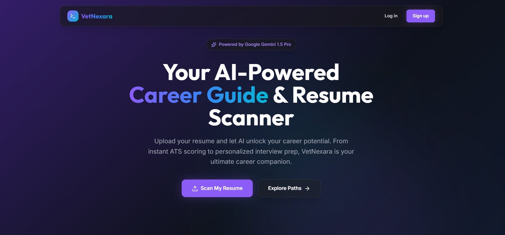
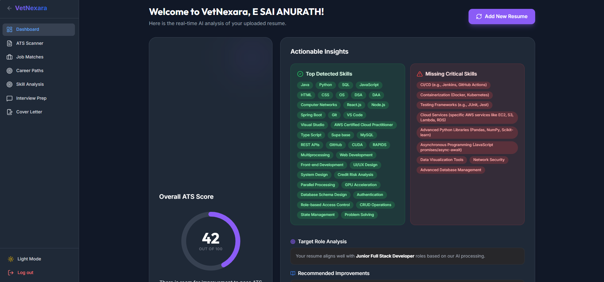
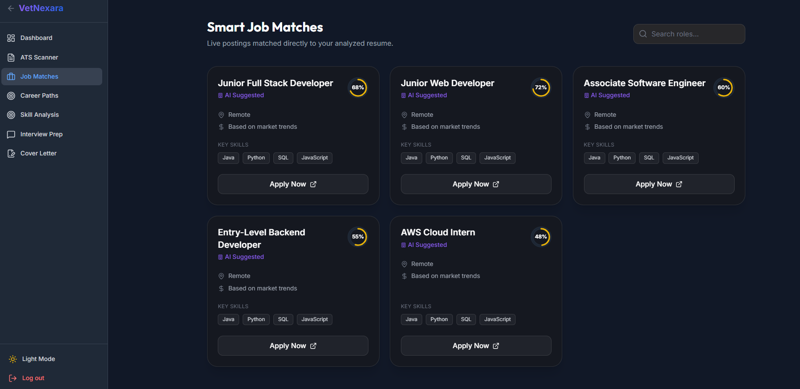

<div align="center">

# 🧠 VetNexara
### *Your AI-Powered Resume Intelligence & Career Command Center*

> **"Don't just apply. Get selected."**

[](https://your-live-url.vercel.app)
[](https://github.com/your-username/vetnexara)
[](https://ai.google.dev/)
[](https://vitejs.dev/)
[](https://nodejs.org/)
[](https://www.mongodb.com/atlas)

---

</div>

## 🎯 What is VetNexara?

**VetNexara** is a full-stack AI-powered resume intelligence platform that goes far beyond a basic ATS checker. Upload your resume once — and get a **360° career analysis** powered by **Google Gemini 1.5 Pro**:

- 📊 Real-time **ATS Score** with breakdown
- 💼 **Dynamic Job Matches** tailored to your resume
- 🔍 **Skill Gap Analysis** showing exactly what you're missing
- 🗺️ **Career Path Recommendations** based on your background
- 🎤 **Interview Prep Questions** specific to your target role
- ✉️ **AI-Generated Cover Letter** personalized to any job
- 📧 **Automated ATS Report** sent to your registered email

---

## ✨ Key Features

| Feature | Description |
|--------|-------------|
| 🔐 **JWT Authentication** | Secure login & registration with token-based auth |
| 📄 **Resume Upload & Parse** | Upload PDF/DOCX — auto-extracts text for AI analysis |
| 📊 **ATS Score Dashboard** | Visual score breakdown: keywords, formatting, skills, experience |
| 💼 **Job Match Finder** | Dynamically matches your resume to relevant job roles |
| 🔍 **Skill Gap Analysis** | Identifies skills you have, skills you lack, and what to learn next |
| 🗺️ **Career Path Recommender** | AI suggests career trajectories based on your resume |
| 🎤 **Interview Prep Coach** | Generates role-specific expected interview questions |
| ✉️ **Cover Letter Generator** | Creates a tailored cover letter for any job description |
| 📧 **Email ATS Report** | Auto-sends your full ATS report to your registered email via Gmail |
| 🌗 **Dark / Light Mode** | Full theme support across the entire app |

---

## 🧱 Tech Stack

### 🖥️ Frontend
```
⚛️  React 18 + Vite         → Fast, modern UI framework
🎨  Tailwind CSS             → Utility-first styling
🔄  React Context API        → Auth & Theme state management
🛡️  Protected Routes         → JWT-guarded navigation
📦  Axios                    → API communication
```

### 🔧 Backend
```
🟢  Node.js + Express        → REST API server
🔐  JWT (jsonwebtoken)       → Authentication middleware
📂  Multer                   → Resume file upload handling
📃  pdf-parse                → PDF text extraction
🤖  @google/generative-ai    → Gemini 1.5 Pro SDK
📧  Nodemailer + Gmail App Password → Email delivery
```

### 🗄️ Database & AI
```
🍃  MongoDB Atlas             → Cloud database (users, scan history)
🧠  Google Gemini 1.5 Pro    → All AI features (analysis, matching, generation)
```

---

## 📁 Project Structure

```
VetNexara/
│
├── 📁 frontend/                     # React + Vite Application
│   ├── 📁 public/
│   ├── 📁 src/
│   │   ├── 📁 assets/               # Images, icons, static files
│   │   ├── 📁 components/
│   │   │   ├── 📁 layout/
│   │   │   │   ├── 📄 Navbar.jsx    # Top navigation bar
│   │   │   │   ├── 📄 Sidebar.jsx   # Side navigation panel
│   │   │   │   └── 📄 Footer.jsx    # App footer
│   │   │   └── 📄 ProtectedRoute.jsx # JWT-protected route wrapper
│   │   ├── 📁 context/
│   │   │   ├── 📄 AuthContext.jsx   # User auth state (login/logout/token)
│   │   │   └── 📄 ThemeContext.jsx  # Dark/Light mode toggle
│   │   ├── 📁 pages/
│   │   │   ├── 📄 Landing.jsx       # 🏠 Home / Hero page
│   │   │   ├── 📄 Login.jsx         # 🔐 Login page
│   │   │   ├── 📄 Register.jsx      # 📝 Registration page
│   │   │   ├── 📄 Dashboard.jsx     # 📊 Main user dashboard
│   │   │   ├── 📄 Scanner.jsx       # 📄 Resume upload & ATS analysis
│   │   │   ├── 📄 JobMatch.jsx      # 💼 Dynamic job matches
│   │   │   ├── 📄 SkillGap.jsx      # 🔍 Skill gap analysis
│   │   │   ├── 📄 CareerPaths.jsx   # 🗺️ Career path recommendations
│   │   │   ├── 📄 InterviewPrep.jsx # 🎤 AI interview questions
│   │   │   └── 📄 CoverLetter.jsx   # ✉️ Cover letter generator
│   │   ├── 📄 App.jsx
│   │   ├── 📄 App.css
│   │   ├── 📄 main.jsx
│   │   └── 📄 index.css
│   ├── 📄 index.html
│   ├── 📄 vite.config.js
│   ├── 📄 tailwind.config.js
│   ├── 📄 postcss.config.js
│   └── 📄 package.json
│
└── 📁 backend/                      # Node.js + Express API
    ├── 📁 middleware/
    │   └── 📄 authMiddleware.js     # JWT verification middleware
    ├── 📁 models/
    │   ├── 📄 User.js               # MongoDB user schema
    │   └── 📄 ResumeScan.js         # MongoDB scan history schema
    ├── 📁 routes/
    │   ├── 📄 auth.js               # /api/auth → register, login
    │   └── 📄 scanner.js            # /api/scan → all AI analysis routes
    ├── 📁 utils/
    │   ├── 📄 emailHelper.js        # Nodemailer + Gmail App Password
    │   └── 📄 pdfGenerator.js       # ATS report PDF generation
    ├── 📄 server.js                 # Express app entry point
    └── 📄 package.json
```

---

## 🚀 Getting Started

### ✅ Prerequisites

Make sure you have the following installed:
- [Node.js](https://nodejs.org/) (v18 or above)
- [MongoDB Atlas](https://www.mongodb.com/atlas) account
- [Google Gemini API Key](https://ai.google.dev/)
- Gmail account with [App Password](https://support.google.com/accounts/answer/185833) enabled

---

### 🖥️ Frontend Setup

```bash
# 1. Navigate to frontend directory
cd frontend

# 2. Install dependencies
npm install

# 3. Create .env file
VITE_API_URL=http://localhost:5000

# 4. Start development server
npm run dev
```

🌐 Frontend runs at: `http://localhost:5173`

---

### 🔧 Backend Setup

```bash
# 1. Navigate to backend directory
cd backend

# 2. Install dependencies
npm install

# 3. Create .env file with the following:
PORT=5000
MONGO_URI=your_mongodb_atlas_connection_string
JWT_SECRET=your_super_secret_jwt_key
GEMINI_API_KEY=your_google_gemini_api_key
EMAIL_USER=your_gmail@gmail.com
EMAIL_PASS=your_gmail_app_password

# 4. Start the backend server
node server.js

# OR with auto-restart (recommended)
npx nodemon server.js
```

✅ Backend runs at: `http://localhost:5000`

---

### 🍃 MongoDB Atlas Setup

```
1. Go to https://cloud.mongodb.com
2. Create a new Project → Create a Cluster (free tier works)
3. Click "Connect" → "Connect your application"
4. Copy the connection string → paste into backend .env as MONGO_URI
5. Replace <password> with your DB user password
6. Whitelist your IP: Network Access → Add IP Address → Allow from Anywhere (0.0.0.0/0)
```

---

## 🤖 How the AI Works

```
📄 User uploads Resume (PDF/DOCX)
         ↓
🔍 Backend extracts text using pdf-parse
         ↓
🧠 Text is sent to Google Gemini 1.5 Pro
         ↓
📦 Gemini returns structured JSON:
   ├── ATS Score + Breakdown
   ├── Matched Job Roles (dynamic)
   ├── Skill Gap (strong / missing)
   ├── Career Path Suggestions
   ├── Expected Interview Questions
   └── Cover Letter Draft
         ↓
📧 ATS Report auto-emailed to registered user
         ↓
📊 All data rendered live on Dashboard
```

> **Every result is unique to the uploaded resume — nothing is hardcoded.**

---

## 📸 Screenshots

> *(Add your app screenshots here)*

| Landing Page | ATS Dashboard | Job Match |
|---|---|---|
|  |  |  |

---

## 🌐 API Endpoints

| Method | Route | Description |
|--------|-------|-------------|
| `POST` | `/api/auth/register` | Register a new user |
| `POST` | `/api/auth/login` | Login & receive JWT token |
| `POST` | `/api/scanner/scan` | Upload resume → full AI analysis |
| `GET`  | `/api/scanner/history` | Fetch past scan results |
| `POST` | `/api/scanner/cover-letter` | Generate tailored cover letter |
| `POST` | `/api/scanner/interview-prep` | Generate interview questions |

---

## 🔮 Future Enhancements

- [ ] 🛡️ Admin Panel for dynamic job/skill/domain management
- [ ] 📊 Analytics dashboard (most common skill gaps, top matched roles)
- [ ] 🌍 Multi-language resume support
- [ ] 📱 Mobile app (React Native)
- [ ] 🔗 LinkedIn profile import
- [ ] 📂 Resume version history & comparison

---

## 👨‍💻 Author

<div align="center">

| | |
|---|---|
| **Name** | Eshwarapragada Sai Anurath |
| **Roll No** | 2303A51560 |
| **Batch** | 29 |
| **Institution** | SR University, Warangal |
| **GitHub** | [E.SAI ANURATH |

</div>

---

<div align="center">

### ⭐ If this project helped you, please give it a star!

*Built with 💙 using React, Node.js, MongoDB & Google Gemini AI*

**VetNexara — Resume Smarter. Career Harder.**

</div>
